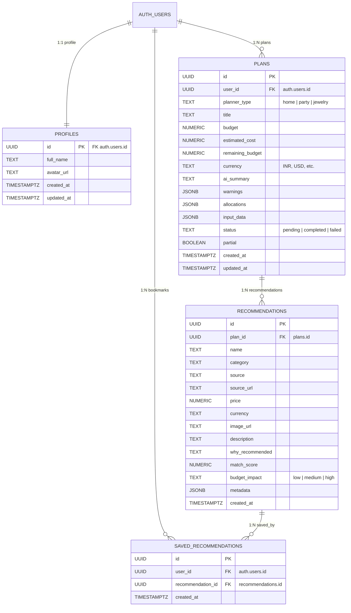

# PocketSmart AI — Database Schema & Architecture

The database runs on **Supabase PostgreSQL 15** with Row-Level Security (RLS) enabled across all public tables.

---

## Entity Relationship Diagram

---

## Table Definitions

### 1. `profiles`
Stores supplementary user profile metadata linked to Supabase's `auth.users` system table.
* **Auto Trigger**: Creates a profile row upon new user registration (`on_auth_user_created`).
* **Auto Timestamp**: Updates `updated_at` on modification.

### 2. `plans`
Represents an individual budget plan.
* **Columns**:
  * `id`: Primary UUID.
  * `user_id`: Owning user ID (enforced via foreign key and RLS).
  * `planner_type`: Enum string (`home`, `party`, `jewelry`).
  * `budget`, `estimated_cost`, `remaining_budget`: High precision numeric fields.
  * `allocations`: JSONB array of category allocations with allotted amounts and percentages.
  * `warnings`: JSONB list of budget alerts and advice.
  * `input_data`: JSONB representation of raw user form input for plan reproducibility.

### 3. `recommendations`
Stores individual item recommendations produced for a specific plan.
* **Columns**:
  * `plan_id`: Foreign key referencing parent `plans.id` (Cascading delete).
  * `match_score`: Float between 0 and 100 indicating alignment with aesthetic & constraints.
  * `budget_impact`: Qualitative impact badge (`low`, `medium`, `high`).
  * `metadata`: Dynamic JSONB storing attributes (dimensions, materials, color matching, etc.).

### 4. `saved_recommendations`
Bookmark join table enabling users to curate and save specific recommendations across plans.

---

## Row-Level Security (RLS) Policies

All tables have RLS enabled:
* Users can only `SELECT`, `INSERT`, `UPDATE`, and `DELETE` their own rows (`auth.uid() = user_id`).
* `recommendations` can be accessed if the user owns the parent plan (`EXISTS (SELECT 1 FROM plans WHERE plans.id = recommendations.plan_id AND plans.user_id = auth.uid())`).
* Service role tokens bypass RLS for administrative tasks.
